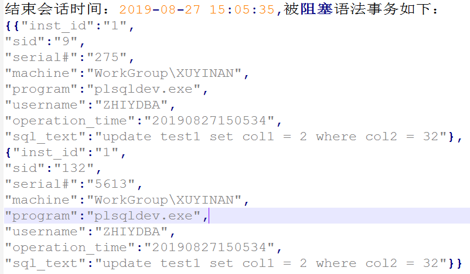
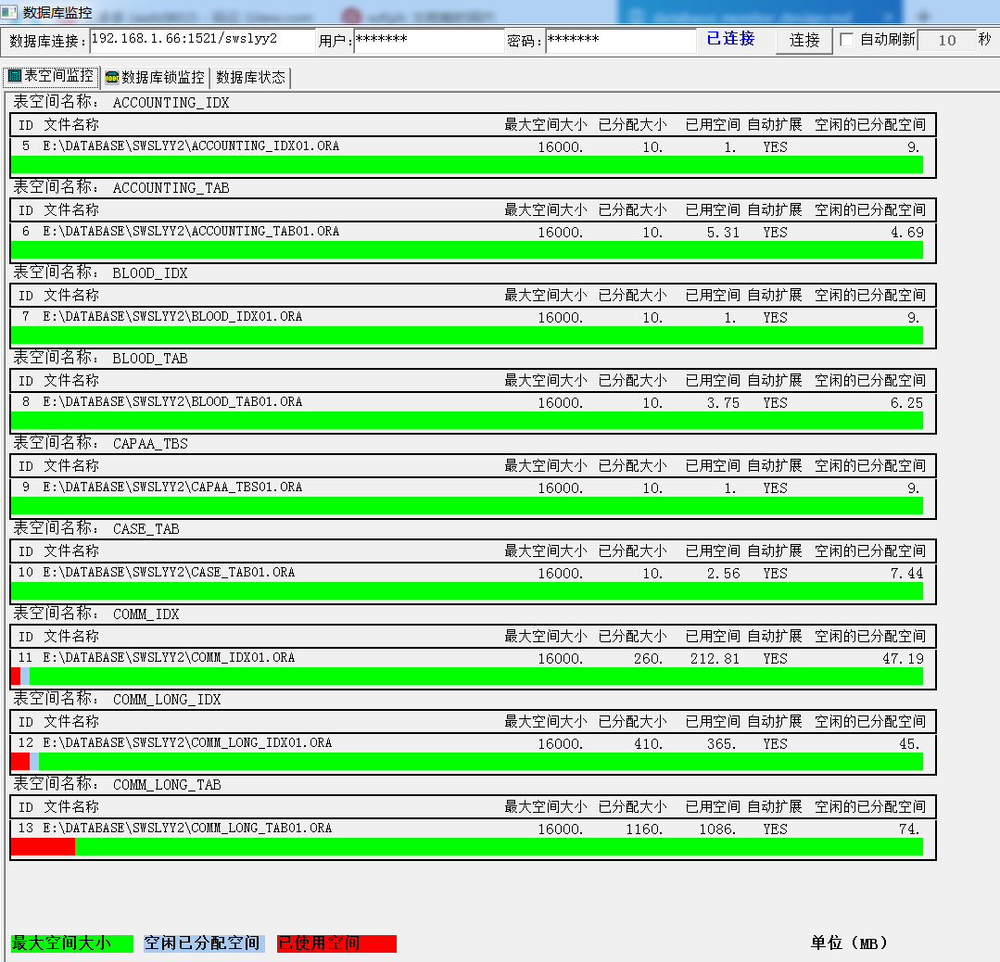

<link href="../zoe_docs.css" rel="stylesheet" type="text/css" />

[上一页](./devops_index.html)

###	数据库监控
1.	会话阻塞与锁监控
	1.	界面元素：内容-样式
		*	会话阻塞情况-树
		*	会话详细信息-表
		*	对象锁信息-表
	2.	操作元素
		*	结束指定会话
		*	保存会话阻塞信息  
			以json格式保存
			记录保存该应用程序下面，文件名例如：'\kill_session_20190827.sql'  
			
2.	表空间使用监控
	1.	界面元素：内容-样式
		*	表空间使用状态-表  
			  
			绿色：表示最大空间大小  
			蓝色：空闲已分配空间大小  
			红色：已使用空间大小

[上一页](./devops_index.html)

