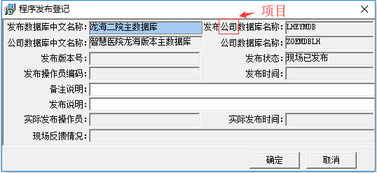
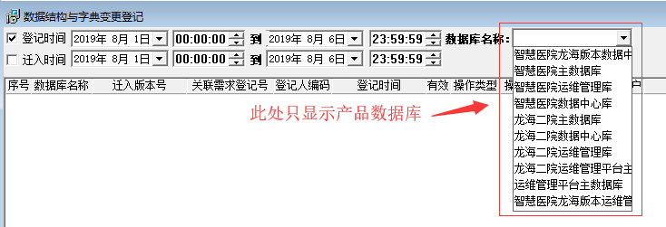

<link href="../../zoe_docs.css" rel="stylesheet" type="text/css" />

[上一页](../devops_index.html)

###	2019.08.13
*	功能变更
	*	登记支持复制功能，用于2个数据库增加同样的内容
	*	数据字典变更时用户选择应只弹出可维护的字典用户
*	BUG
	*	数据结构与字典变更登记-修改登记内容时无法保存，保存没有提示错误但保存数据丢失。
	*	
	*	数据字典变更选择其它数据库是界面不会改成数据维护
###	2019.08.06
*	功能变更
	*	
	*	菜单：系统维护-用户密码修改 移动到  基本信息维护
	*	增加配置文件参数：根据配置文件参数隐藏菜单项
		*	[ZOEVER_CONFIG]  
			版本管理配置信息：1：只允许选择有配置的数据库信息；9：可以手工输入数据库信息  
			DATABASE_MONITOR_CONFIG = 9  
			数据库监控显示0：版本管理；1：数据库服务监控  
			MONITOR_DATABASE_FLAG = 0  
			写入被阻塞的记录数  
			KILL_SESSION_WRITE_RECORDS_NUM = 5  
			自动刷新标志0：不自动刷新；1：自动刷新  
			AUTO_RETRIEVE = 1  
			自动刷新间隔，单位秒  
			AUTO_RETRIEVE_TIME = 10  
			菜单隐藏设置1：可见；0：不可见  
			程序版本控制  
			VERSION_CONCTOL  = 1  
			数据库运维与监控  
			DATABASE_MONITOR = 1  
			基本信息维护  
			BASE_INFO_CONFIG = 1  
			系统维护  
			SYSTEM_CONFIG    = 1  

[上一页](../devops_index.html)