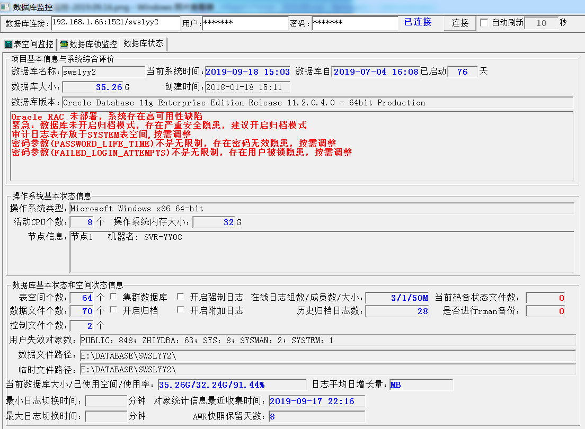

<link href="../../zoe_docs.css" rel="stylesheet" type="text/css" />

[上一页](../devops_index.html)

###	2019.09.02
*	BUG
	*	优化数据库死锁监控  
		数据库阻塞监控中的层级关系，采用界面程序上处理，不通过sql语句去实现
###	2019.09.16
*	功能变更  
	
	*	主要监控数据库的状态信息，包括：  
		（1）数据库的综合评价  
		（2）操作系统的基本信息  
		（3）数据库的基本状态和空间状态  

[上一页](../devops_index.html)