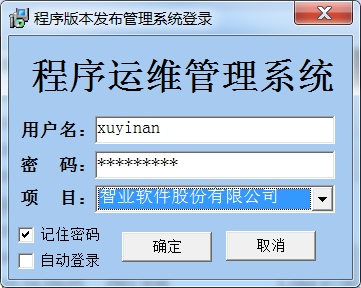
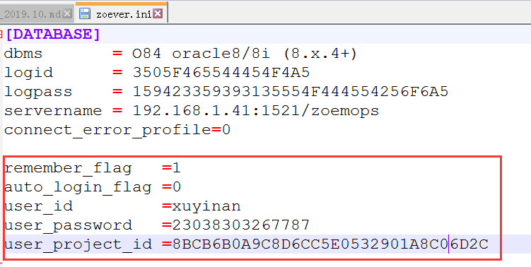

<link href="../../zoe_docs.css" rel="stylesheet" type="text/css" />

[上一页](../devops_index.html)

###	2019.10.15
*	BUG
	*	数据库死锁监控无法删除锁信息	
		在现场出现死锁的情况，无法结束会话信息，主要原因：  
		在现场是多实例的环境，出现堵塞，保存在gv$sql的sql_hash_value是一样的，不同实例，导致程序获取的时候出现返回值多余一行
###	2019.10.15
*	功能变更  
	
	*	优化数据库运维管理，包括：  
		（1）登录界面增加记住密码和自动登录功能   
		（2）优化所有者与数据对象选择窗口  
		
[上一页](../devops_index.html)