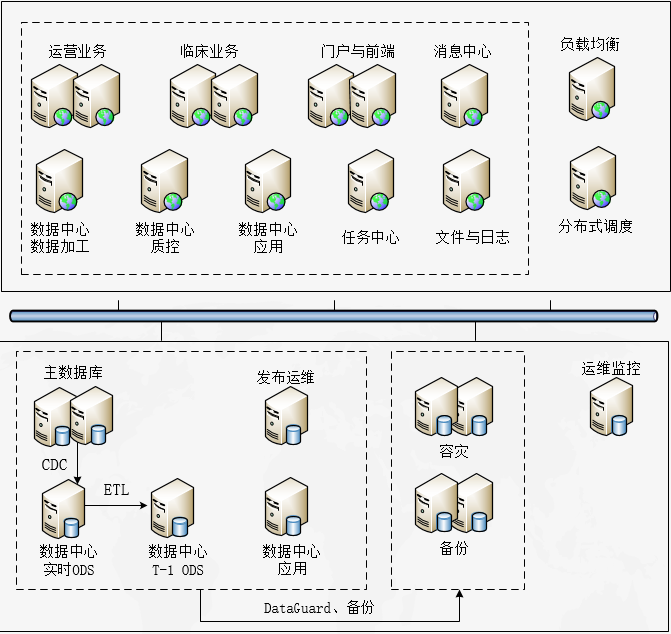

<link href="../../zoe_docs.css" rel="stylesheet" type="text/css" />

[上一页](../faultprocess_index.html)

###	HIS5.0性能优化指导

1.	HIS5.0系统架构  
	
2.	软件基本组件
	>|应用模块|模块名|应用模块|模块名|
	>|:---|:---|:---|:---|
	>|HIS医生API|zoe-emr-doctor-service|HIS护士API|zoe-emr-nurse-service|
	>|HIS收费API|zoe-split-charge-service|HIS门诊API|zoe-emr-outpatient-service|
	>|HIS票据API|zoe-emr-billreport-service|后台管理前端-票据|zoe-emr-billreport-web|
	>|HIS模板API|zoe-emr-template-service|后台管理前端-模板|zoe-emr-template-web|
	>|HIS病案API|zoe-emr-archive-service|智能书写提示|zoe-intellisense-service
	>|报表管理后端服务|zoe-optimus-report|报表查看服务|zoe-optimus-web-report|
	>|HIS后端服务|zoe-optimus-web-api|后台管理前端服务|zoehis-web-manage|
	>|数据中心后端服务|zoe-optimus-dc-web|
	>|门户后端服务|zoe-optimus-web-portal|门户前端服务|zoehis-web-portal|
	>|数据中心应用后端服务|zoe-optimus-web-dc-app|数据中心应用前端服务|zoehis-web-hip|
	>|消息中心管理后端|zoe-optimus-web-message|消息应用中心服务|zoe-optimus-message-app
	>|消息消费者服务|zoe-optimus-message-consumer-web|数据加工引擎服务|zoe-optimus-dc-service-working-engine|
	>|数据质量管理平台后端服务|zoe-optimus-qual-web|数据质量管理平台前端服务|zoehis-web-qual|
	>|第三方接口|zoe-optimus-web-adapter|规则引擎后端服务|zoe-optimus-rule-web|
	>|定时器后端服务|zoe-optimus-web-quartz|监控后端服务|zoe-defensor-monitor|
	>|浏览器更新后端服务|zoe-update-service|浏览器更新前端服务|zoe-update-manager|
	>|订阅引擎服务|zoe-optimus-dc-service-subscpt-engine|

3.	性能优化指导
	1.	总体性能分析
		*	基本数据情况分析：本次数据采样基于邳州人民医院HIS5系统，系统上线一个月。基本业务指标如下：
			>|基本指标|指标值|基本指标|指标值|
			>|:---|---:|:---|---:|
			>|总数据量     		|20GB   |
			>|门诊诊病数   		|2603   |在院数   			|722    |
			>|门诊费用条目数	|17301  |住院费用条目		|28576  |
			>|门诊摆药条目数	|4047   |住院摆药条目数		|7760   |
		*	分析业务指标，在以系统数据量20GB，门诊2000，在院500为基准时。操作系统性能指标要求：
			>|基本指标|指标值|基本指标|指标值|
			>|:---|---:|:---|---:|
			>|磁盘iops			|200		|数据库登录数	|3210		|
			>|磁盘读带宽		|10MB/秒	|磁盘写带宽		|3MB		|
			>|业务网发送带宽	|500KB/秒	|业务网接收带宽	|300KB/秒	|
			>|心跳网发送带宽	|1MB/秒		|心跳网接收带宽	|1.5MB/秒	|
		*	应用服务指标分析
			*	应用服务负载主要集中在收费服务（100万/天），医嘱服务（50万/天），后台公用服务（50万/天），医生服务（10万/天），护士服务（10万/天）。负载数据分布上与业务特性吻合。
			*	其中收费、医嘱、后台峰值负载分别为3000/分钟、1500/分钟、1500/分钟。平均延时40毫秒、20毫秒、40毫秒。根据负载数据分析，应用服务推荐部署收费4台，医嘱2台，后台2台。
	2.	API性能优化分析
		*	基本情况分析：从平均执行时间、总执行时间、最大执行时间获取最消耗资源以及执行稳定性较差的API。
			*	数据分析平均执行时间大于1秒的API，且和窗口业务相关的API，根据业务操作频率判断是否需要优化
				>|Uri|排序方式|
				>|:---|:---|
				>|/dict/deduct/deduct/deductAllBill						|平均执行时间：3600		|
				>|/pres/presCtrl/saveChinese							|平均执行时间：1991     |
				>|/dict/settle/settleManage/inpSettle					|平均执行时间：1801     |
				>|/pres/apply/execApplys								|平均执行时间：1609     |
				>|/pres/collate/collatePrescribes						|平均执行时间：1480     |
				>|/charge/convert/inpRate/inpRateConvert				|平均执行时间：1044     |
				>|/pres/presCtrl/saveWesternMedicine					|平均执行时间：1037     |
				>|/dispensing/inp/dispensing/dispensingDrugs			|平均执行时间：952	    |
			*	数据分析总执行时间TOP 10的API，且和窗口业务相关的API，根据业务量判断执行数是否合理
				>|Uri|排序方式|
				>|:---|:---|
				>|/dict/patient/manager/getAutoPatientInfo			  |总执行次数：60173	 |
				>|/dict/prescribe/manager/getPendingPatientInfo		  |总执行次数：215171	 |
				>|/insur/insurManager/insurInterface				  |总执行次数：42404	 |
				>|/pres/collate/collatePrescribes					  |总执行次数：1711	     |
				>|/pres/presCtrl/saveWesternMedicine				  |总执行次数：2205	     |
				>|/pres/presCtrl/save								  |总执行次数：3567	     |
				>|/dict/drug/getDrugList							  |总执行次数：40225	 |
				>|/i18n/dictLanguageInfo/findI18nListByClassCode	  |总执行次数：155056	 |
				>|/dict/settle/settleManage/outpSettle				  |总执行次数：4732	     |
				>|/pres/apply/execApplys							  |总执行次数：779	     |
			*	数据分析最大执行时间TOP 10的API，且和窗口业务相关的API，根据业务时间要求判断是否需要优化
				>|Uri|排序方式|
				>|:---|:---|
				>|/dict/deduct/deduct/deductAllBill					 	|最大执行时间：61570	|	
				>|/pres/collate/collatePrescribes					 	|最大执行时间：49743	|   	
				>|/dispensing/inp/dispensing/layDrugDeductReturnDrug 	|最大执行时间：13128	|   	
				>|/dispensing/inp/dispensing/dispensingDrugsSingle	 	|最大执行时间：10551	|		
				>|/insur/insurManager/insurInterface				 	|最大执行时间：9652	   	|
				>|/dict/prescribe/inpDrugPrintRecord/print			 	|最大执行时间：8492		|	
				>|/emr/dataAide/emrDataAide/toImageList				 	|最大执行时间：7745		|	
4.	系统基线指标
	1.	业务指标（获取SQLDEVEOPER 报告）
		*	日在院人数
		*	最大住院日摆药条目数
		*	最大住院日费用条目数
		*	最大日门诊诊病数
		*	最大门诊日摆药条目数
		*	最大门诊日费用条目数
		*	最大日消息记录
		*	最大日通知记录
	2.	操作系统指标（获取sar语法）
		*	磁盘读（KB）/秒
		*	磁盘写（KB）/秒
		*	磁盘读写次数/秒
		*	磁盘平均等待时间
		*	业务网络发送（KB）/每秒
		*	业务网络接收（KB）/每秒
		*	心跳网络发送（KB）/每秒
		*	心跳网络接收（KB）/每秒
	3.	数据库指标（获取SQLDEVEOPER 报告）
		*	日总连接数
	4.	应用指标（获取应用流量监控与Elastic脚本）  
		__脚本位置：elasticsearch/his5_performance_tuning.lua__
		1. 总体性能分析
			*	HIS后端服务-8082 日请求数、高峰请求时（小时）、高峰请求数（分钟）
			*	HIS收费API-6055  日请求数、高峰请求时（小时）、高峰请求数（分钟）
			*	HIS医嘱API-6054	 日请求数、高峰请求时（小时）、高峰请求数（分钟）
			*	HIS医生API-6051	 日请求数、高峰请求时（小时）、高峰请求数（分钟）
			*	HIS护士API-6052	 日请求数、高峰请求时（小时）、高峰请求数（分钟）
			*	HIS模版API-6050	 日请求数、高峰请求时（小时）、高峰请求数（分钟）
			*	HIS病案API-6057	 日请求数、高峰请求时（小时）、高峰请求数（分钟）
			*	HIS票据API-6053	 日请求数、高峰请求时（小时）、高峰请求数（分钟）
			*	HIS门诊API-6056  日请求数、高峰请求时（小时）、高峰请求数（分钟）
			*	HIS后端服务-8082 平均请求时间（毫秒）、最大请求时间（毫秒）
			*	HIS收费API-6055	 平均请求时间（毫秒）、最大请求时间（毫秒）
			*	HIS医嘱API-6054	 平均请求时间（毫秒）、最大请求时间（毫秒）
			*	HIS医生API-6051	 平均请求时间（毫秒）、最大请求时间（毫秒）
			*	HIS护士API-6052	 平均请求时间（毫秒）、最大请求时间（毫秒）
			*	HIS模版API-6050	 平均请求时间（毫秒）、最大请求时间（毫秒）
			*	HIS病案API-6057	 平均请求时间（毫秒）、最大请求时间（毫秒）
			*	HIS票据API-6053	 平均请求时间（毫秒）、最大请求时间（毫秒）
			*	HIS门诊API-6056	 平均请求时间（毫秒）、最大请求时间（毫秒）
		2.	单项API性能分析
			*	分析API以平均执行时间、最大执行时间、总执行时间降序排列
5.	指标记录                                                                	
	1.	业务指标                                                            	
		>|基线指标|指标时间|指标值|基线指标|指标时间|指标值|                
		>|:---|:---|---:|:---|:---|---:|
		>|当前在院数	        | 2019/9/3 19:14	| 547       | 当前在院数			| 2019/9/4 20:57	| 722       | 
		>|最大住院日摆药条目数	| 2019/9/3 0:00		| 4783      | 最大住院日摆药条目数	| 2019/9/4 0:00		| 7760      | 
		>|最大住院日费用条目数	| 2019/8/28 0:00	| 16866     | 最大住院日费用条目数	| 2019/9/4 0:00		| 28567     | 
		>|最大日门诊诊病数	    | 2019/9/3 0:00		| 2298      | 最大日门诊诊病数		| 2019/9/4 0:00		| 2603      | 
		>|最大门诊日摆药条目数	| 2019/9/3 0:00		| 2961      | 最大门诊日摆药条目数	| 2019/9/4 0:00		| 4047      | 
		>|最大门诊日费用条目数	| 2019/9/3 0:00		| 13739     | 最大门诊日费用条目数	| 2019/9/4 0:00		| 17301     | 
		>|消息日志				| 2019/9/3 0:00		| 179465    | 消息日志				| 2019/9/4 0:00		| 238325    | 
		>|通知记录				| 2019/9/3 0:00		| 148927    | 通知记录				| 2019/9/4 0:00		| 218764    | 
	2.	操作系统指标
		>|指标说明|性能指标|指标值|  
		>|:---|:---|---:|
		>|上午高峰期8-10点平均值	| 磁盘读写次数/秒			| 116.02    |
		>|上午高峰期8-10点平均值	| 磁盘读（KB）/秒			| 5108.85   |
		>|上午高峰期8-10点平均值	| 磁盘写（KB）/秒			| 1396.66   |
		>|上午高峰期8-10点平均值	| bond0网络接收（KB）/秒	| 168       |
		>|上午高峰期8-10点平均值	| bond0网络发送（KB）/秒	| 373       |
		>|上午高峰期8-10点平均值	| bond1网络接收（KB）/秒	| 717       |
		>|上午高峰期8-10点平均值	| bond1网络发送（KB）/秒	| 665       |
		>|上午高峰期8-10点平均值	| bond0网络接收包/秒		| 362       |
		>|上午高峰期8-10点平均值	| bond0网络发送包/秒		| 486       |
		>|上午高峰期8-10点平均值	| bond1网络接收包/秒		| 1161      |
		>|上午高峰期8-10点平均值	| bond1网络发送包/秒		| 1120      |
	3.	数据库指标
		>|指标说明|指标日期|指标值|
		>|:---|:---|---:|
		>|近一个月来单日最大登录数	| 2019.09.03     			| 3210    |
		>|表空间大小（MB）          | 2019.09.04    			| 20477.56   | 
		>|ZOECOMM_TAB				| 2019.09.04   				| 11058.5   | 
		>|ZOEMSG_TAB				| 2019.09.04   				| 3532.75   | 
		>|ZOEEMR_TAB				| 2019.09.04   				| 2142.56   | 
		>|ZOETMP_TAB				| 2019.09.04   				| 1244.25   | 
		>|ZOEINSUR_TAB				| 2019.09.04   				| 385.75   | 
		>|ZOEQUARTZ_TAB				| 2019.09.04   				| 353.93   | 
		>|ZOEINTERCHANGE_TAB		| 2019.09.04   				| 288.12   | 
		>|ZOETEMPLATE_TAB			| 2019.09.04   				| 287.43   | 
		>|USERS						| 2019.09.04   				| 242.18   | 
		>|ZOEAPPLY_TAB				| 2019.09.04   				| 138.06   | 
		>|ZOECHARGE_IND				| 2019.09.04   				| 119.5   | 
		>|ZOESECURITY_TAB			| 2019.09.04   				| 96.25   | 
		>|ZOEPATIENT_TAB			| 2019.09.04   				| 92.56   | 
		>|ZOEPORTAL_TAB				| 2019.09.04   				| 91.81   | 
		>|ZOEPRES_IND				| 2019.09.04   				| 84.43   | 
		>|ZOEMSG_IND				| 2019.09.04   				| 80.18   | 
		>|ZOEAPPLY_IND				| 2019.09.04   				| 69.93   | 
		>|ZOEDRUG_TAB				| 2019.09.04   				| 52.62   | 
		>|ZOEEMR_IND				| 2019.09.04   				| 29.43   | 
		>|ZOEDICT_TAB				| 2019.09.04   				| 28.25   | 
		>|ZOEINSUR_IND				| 2019.09.04   				| 20   | 
	4.	应用指标
		>|应用服务|请求日期|请求数|
		>|:---|:---|---:|
		>|HIS票据API-6053	|2019.09.03	|15479     |
		>|HIS门诊API-6056 	|2019.09.03	|49587     |
		>|HIS后端服务-8082	|2019.09.03	|496149    |
		>|HIS收费API-6055	|2019.09.03	|1014769   |
		>|HIS医嘱API-6054	|2019.09.03	|470693    |
		>|HIS医生API-6051	|2019.09.03	|146513    |
		>|HIS护士API-6052	|2019.09.03	|126619    |
		>|HIS模版API-6050	|2019.09.03	|40692     |
		>|HIS病案API-6057	|2019.09.03	|3490      |
		>|HIS票据API-6053	|2019.09.03	|19592     |
		>|HIS门诊API-6056 	|2019.09.03	|53307     |

		>|应用服务|高峰时段|小时请求数|分钟请求数|
		>|:---|:---|---:|---:|
		>|HIS票据API-6053   |10:00:00   |2477     |        |
		>|HIS门诊API-6056   |10:00:00   |7903     |        |
		>|HIS后端服务-8082  |8:00:00    |57404    | 1336   |
		>|HIS收费API-6055   |8:00:00    |148328   | 3000   |
		>|HIS医嘱API-6054   |9:00:00    |61512    | 1272   |
		>|HIS医生API-6051   |15:00:00   |16344    |        |
		>|HIS护士API-6052   |15:00:00   |17072    |        |

		>|应用服务|最大请求时间（毫秒）|平均请求时间（毫秒）|标准差|
		>|:---|---:|---:|---:|
		HIS后端服务-8082	|9006	|34		|151   |
		HIS收费API-6055		|6661	|31		|76    |
		HIS医嘱API-6054		|2130	|16		|34    |
		HIS医生API-6051		|5580	|48		|107   |
		HIS护士API-6052		|2458	|41		|69    |
		HIS模版API-6050		|1392	|21		|59    |
		HIS病案API-6057		|1026	|23		|27    |
		HIS票据API-6053		|5776	|122	|167   |
		HIS门诊API-6056 	|4397	|41		|117   |
		
		__平均执行时间__
		
		>|APIURI|平均执行时间|执行次数|最大执行时间|最小执行时间|标准差|
		>|:---|---:|---:|---:|---:|---:|
		>|/reservation/scheduleTemplManager/createDoctorSchedule	|5402		|16		|14566	|5		|4976    |   	
		>|/reservation/scheduleManager/updateDoctorScheduleNew		|4623		|32		|11953	|8		|4367    |   	
		>|/i18n/dictLanguageInfo/refreshCache						|3797		|21		|4828	|2479	|589     |   	
		>|/dict/deduct/deduct/deductAllBill							|3600		|135	|61570	|54		|9215    |   
		>|/reservation/scheduleManager/saveDoctorScheduleNew		|2733		|38		|11087	|11		|3210    |   
		>|/pres/presCtrl/saveChinese								|1991		|12		|3960	|490	|1160    |   
		>|/dict/settle/settleManage/inpSettle						|1801		|71		|7673	|176	|1445    |   
		>|/pres/apply/execApplys									|1609		|779	|7070	|65		|1119    |   
		>|/sys/param/refreshCache									|1593		|18		|2119	|1316	|203     |   
		>|/pres/collate/collatePrescribes							|1480		|1711	|49743	|9		|2310    |   
		>|/charge/convert/inpRate/inpRateConvert					|1044		|19		|2429	|116	|836     |   
		>|/pres/presCtrl/saveWesternMedicine						|1037		|2205	|3646	|16		|491     |   
		>|/dispensing/inp/dispensing/dispensingDrugs				|952		|27		|5133	|114	|1434    |   
		
		__总执行时间__
		
		>|APIURI|平均执行时间|执行次数|最大执行时间|最小执行时间|标准差|
		>|:---|---:|---:|---:|---:|---:|
		>|/dict/patient/manager/getAutoPatientInfo					|102	|60173		|1535		|5		|44     | 
		>|/dict/prescribe/manager/getPendingPatientInfo				|18		|215171		|1716		|9		|16     |
		>|/insur/insurManager/insurInterface						|72		|42404		|9652		|3		|158    |
		>|/pres/collate/collatePrescribes							|1480	|1711		|49743		|9		|2310   |
		>|/pres/presCtrl/saveWesternMedicine						|1037	|2205		|3646		|16		|491    |
		>|/pres/presCtrl/save										|532	|3567		|5092		|27		|430    |
		>|/dict/drug/getDrugList									|46		|40225		|643		|15		|20     |
		>|/i18n/dictLanguageInfo/findI18nListByClassCode			|10		|155056		|1424		|2		|11     |
		>|/dict/settle/settleManage/outpSettle						|273	|4732		|4072		|71		|202    |
		>|/pres/apply/execApplys									|1609	|779		|7070		|65		|1119   |
		
		__最大执行时间__
		
		>|APIURI|平均执行时间|执行次数|最大执行时间|最小执行时间|标准差|
		>|:---|---:|---:|---:|---:|---:|
		>|/dict/deduct/deduct/deductAllBill							|3600	|135		|61570		|54		|9215   |   	
		>|/pres/collate/collatePrescribes							|1480	|1711		|49743		|9		|2310   |   
		>|/reservation/scheduleTemplManager/createDoctorSchedule	|5402	|16			|14566		|5		|4976   |   
		>|/dispensing/inp/dispensing/layDrugDeductReturnDrug		|253	|226		|13128		|12		|1033   |   
		>|/reservation/scheduleManager/updateDoctorScheduleNew		|4623	|32			|11953		|8		|4367   |   	
		>|/reservation/scheduleManager/saveDoctorScheduleNew		|2733	|38			|11087		|11		|3210   |   	
		>|/dispensing/inp/dispensing/dispensingDrugsSingle			|192	|348		|10551		|72		|778    |   
		>|/insur/insurManager/insurInterface						|72		|42404		|9652		|3		|158    |   
		>|/dict/prescribe/inpDrugPrintRecord/print					|209	|481		|8492		|15		|644    |   
		>|/emr/dataAide/emrDataAide/toImageList						|614	|291		|7745		|10		|491    |   

6.	附加信息
	1.	ElasticSearch日志分析模式
		*	t_log_req：以API为主索引记录API执行情况，包含以下属性域：
			*	requestId： 一次API请求唯一标识
			*	ipAndPort:  请求服务入口API地址
			*	createTime: 请求服务时间
			*	finishTime: 请求服务完成时间
			*	runTime:    请求服务运行时间
			*	requestUri: 请求服务入口API
		*	t_log_sql：以sql为主索引记录SQL执行情况，包含以下属性域：
			*	requestId： 一次API请求唯一标识
			*	createTime: 请求SQL开始时间
			*	finishTime: 请求SQL完成时间
			*	runTime:    请求SQL运行时间
			*	sqlHash:	请求SQL HASH值（传入参数变量前）
			*	sql:		请求SQL
		*	t_log_warn：以warn为主索引记录执行时间告警情况，包含以下属性域
			*	requestId:	一次API请求唯一标识
			*	type:		API或SQL
			*	createTime:	请求开始时间
			*	runTime:	请求运行时间
			*	taskHash:	
			*	taskContent:
		
	3.	OracleSQL执行记录分析模式
		*	gv$sql_monitor：记录并行执行或是执行超过5秒CPU或IO时间的SQL，语句信息至少保留1分钟。包含以下属性：
			*	sql_id:  		库缓存中父游标的SQL标识符
			*	sql_exec_id:	唯一标识一次SQL执行
			*	ELAPSED_TIME：	语句执行时间，单位微秒
			*	QUEUING_TIME：	语句执行排队时间，单位微秒
			*	CPU_TIME:		语句执行CPU时间，单位微秒
			*	FETCHES:
			*	BUFFER_GETS:
			*	DISK_READS:
			*	DIRECT_WRITES:	
		*	DBA_HIST_SQLSTAT，包含以下属性：
			*	snap_id:
			*	instance_number:
			*	sql_id: 库缓存中父游标的SQL标识符
			*	MODULE:	通过DBMS_APPLICATION_INFO.SET_MODULE设置的HIS5应用服务器地址
			*	ACTION:	通过DBMS_APPLICATION_INFO.SET_ACTION设置的HIS5请求ID
			*	EXECUTIONS_TOTAL:	执行总次数
			*	DISK_READS_TOTAL：	磁盘读总次数
			*	BUFFER_GETS_TOTAL：	buffer get总次数
			*	ELAPSED_TIME_TOTAL：	总消耗时间
			*	IOWAIT_TOTAL：	io总消耗时间，单位微秒
		*	GV$SQLSTATS，包含以下属性：
			*	SQL_TEXT：当前游标的SQL文本的前1000个字符
			*	sql_id: 
			*	MODULE:	通过DBMS_APPLICATION_INFO.SET_MODULE设置的HIS5应用服务器地址
			*	ACTION:	通过DBMS_APPLICATION_INFO.SET_ACTION设置的HIS5请求ID
			*	EXECUTIONS:	执行次数
			*	DISK_READS：	磁盘读次数
			*	BUFFER_GETS：	buffer get次数
			*	ROWS_PROCESSED：解析的sql语句返回的行总数
			*	VERSION_COUNT：具有此sql文本和计划的缓存中存在的游标数
			*	ELAPSED_TIME_TOTAL：	消耗时间，单位微秒
			*	USER_IO_WAIT_TIME：	用户IO等待时间，单位微秒
			*	CONCURRENCY_WAIT_TIME：并发等待时间，单位微秒
			*	CLUSTER_WAIT_TIME：	集群等待时间，单位微秒
		
	4.	常规分析从ElasticSearch日志记录中API请求与SQL执行情况  
		__脚本路径：zoescript/elasticsearch/his5_performance_tuning_guide__
		1.	单个API执行情况分析
			*	获取req索引指定API指定时间按日/小时分组以日期为降序，统计平均执行时间，最大执行时间，最小执行时间及标准方差。以分析执行API执行稳定性
			*	获取req索引指定API指定时间范围内按运行时间排序，以分析指定API异常执行时间情况
		2.	API总体执行情况分析
			*	获取req索引根据API分组按次数、总执行时间、平均运行时间、最大运行时间排序。以分析API使用量情况。
			*	获取指定某日按执行时间分组以最大执行时间为降序的API统计。以分析不同时间分布消耗时间最高API情况
			*	获取req索引dict/drug/getDrugList按日分组以平均执行时间降序。以通过执行频繁最高的API分析日性能稳定性

[上一页](../faultprocess_index.html)
