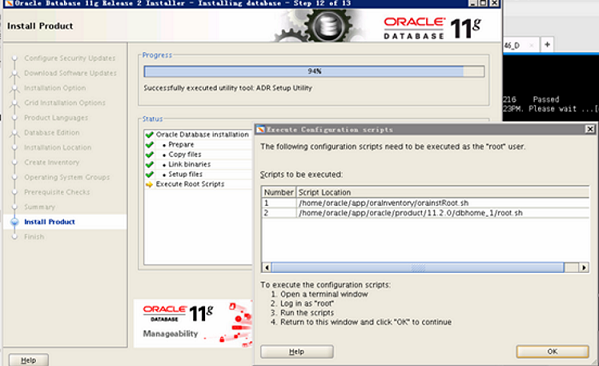

<link href="zoe_docs.css" rel="stylesheet" type="text/css" />

[文档主页](../../index.html)
[上一页](../oracle_for_linux.html)

>	_Created in 2019.10.28 by xuyinan  
>	_Copyright (c) 20xx, CHINA and/or affiliates._  
###	数据库的配置  
*	利用xshell工具进行oracle数据库的创建和配置  
	（1）用xshell连接到服务器，并切换到oracle用户  
		su - oracle  
		本地图形界面设置--本地工具所在ip，这个ip地址是本机的ip地址，不是虚拟机里面那个linux的地址  
		export DISPLAY=10.0.5.3:0.0  
		export LANG=en_US.UTF-8  
	（2）打开Xmanager Enterprise 5\Xmanager - Passive，  
	     可以利用图形化界面去创建数据库和配置监听，操作界面跟windows安装配置一样   
		--打开配置OracleDatabase Configuration Assistant
		dbca 
		--打开配置Net Configuration Assistant  
		netca  
	（3）查看数据库实例是否在监听中注册 lsnrctl status，其中状态位READY就是正常  
		 lsnrctl status  
		  
*	常见问题  
	（1）安装完数据库后，会发现数据库是正常启动着，在服务器上也是可以正常连接数据库，  
		但是其他机器无法连接数据库，提示“The Network Adapter could not establish the connection”  
		一般这种情况下，是服务器防火墙的问题，在root用户下执行
		--查看网络状态是否正常  
		service iptables status   
		--关闭防火墙服务  
		service iptables stop    
	（2）用conn / as sysdba;连接数据库提示ORA-12162: TNS:net service name is incorrectly specified  
		主要原因是oracle中没有指定服务名，解决办法就是设置一下oracle_sid  
		--查看当前ORACLE_HOME的目录  
		echo $ORACLE_HOME  
		--查看当前ORACLE_SID，最好重新设置一下  
		echo $ORACLE_SID  
		--设置oracle_sid，然后重新登录就可以了  
		export ORACLE_SID=dbtest  
		

[文档主页](../../index.html)
[上一页](../oracle_for_linux.html)
