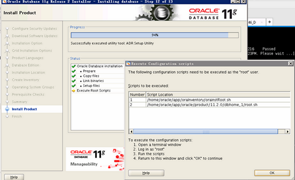

<link href="zoe_docs.css" rel="stylesheet" type="text/css" />

[文档主页](../../index.html)
[上一页](../oracle_for_linux.html)

>	_Created in 2019.10.28 by xuyinan  
>	_Copyright (c) 20xx, CHINA and/or affiliates._  
###	Oracle Database 19c (19.3) for Linux x86-64下载地址  
*	https://www.oracle.com/database/technologies/oracle19c-linux-downloads.html    
	目前最高版本为19.3，需要注意的是linux与windows版本是不一样的
###	Oracle的安装
*	安装Oracle版本  
	Oracle版本11.2.0.4版本  
	安装的环境为linux6.7版本  
*	需要其他插件  
	需要Xmanager Enterprise插件，主要用户连接linux服务器  
*	数据库的安装步骤：  
	（1）用Xmanager Enterprise下的Xshell连接服务器，需要root服务器  
	（2）创建文件夹，并将数据库的安装文件通过ftp工具传到该文件夹中  
	（3）解压Oracle安装文件  
		--进入zysot文件夹  
		cd /home/zysoft  
		--解压文件夹  
		unzip p13390677_112040_Linux-x86-64_1of7.zip  
		unzip p13390677_112040_Linux-x86-64_2of7.zip  
		并把/home/zysoft及子目录的目录权限修改成oracle用户，配置权限  
		chown -R oracle:oinstall /home/zysoft  
	（4）编辑/etc/hosts文件，把该机器的ip地址添加进去
		--查看/etc/hosts文件命令  
		cat /etc/hosts  
		编辑/etc/hosts文件命令  
		vi /etc/hosts  
		I：处于修改状态  
		按下esc键后，输入:wq表示保存退出，:q!表示强制退出  
	（5）切换操作用户,在安装完Oracle Linux 6.7后系统会默认创建oracle用户，这个是操作系统的用户，不是数据库用户  
		su - oracle  
		--编辑环境变量，配置以下内容  
		# for oracle 11g  
		ORACLE_BASE=/home/oracle/app/oracle  
		ORACLE_HOME=$ORACLE_BASE/product/11.2.0/dbhome_1  
		ORACLE_SID=dbtest  
		PATH=$ORACLE_HOME/bin:$PATH:$HOME/bin  
		LD_LIBRARY_PATH=$ORACLE_HOME/lib:$LD_LIBRARY_PATH   
		export PATH LD_LIBRARY_PATH DISPLAY ORACLE_BASE ORACLE_HOME ORACLE_SID  
	（6）查看环境变量运行情况，source .bash_profile生效环境变量，再次env查看  
		env |grep oracle  
		source .bash_profile  
		env |grep oracle  
	（7）创建文件夹database和archivelog，分别作为数据文件和归档日志文件的存储路径  
		cd /home/oracle  
		pwd  
		mkdir database  
		mkdir archivelog  
	（8）本地图形界面设置--本地工具所在ip，这个ip地址是本机的ip地址，不是虚拟机里面那个linux的地址  
		这个是每次都要去设置一下，包括切换用户，或者退出的时候，重新连接后都要去设置  
		export DISPLAY=10.0.5.3:0.0  
		export LANG=en_US.UTF-8  
	（10）开始安装oracle  
		--这个是解压文件的路径  
		cd /home/zysoft/database  
		sh runInstaller  
		在安装最后一步的时候，先不要关闭窗口，返回到xshell界面，用root用户去执行两个脚本，改变参数路径  
		su - root  
		password（密码）  
		/home/oracle/app/oraInventory/orainstRoot.sh  
		/home/oracle/app/oracle/product/11.2.0/dbhome_1/root.sh  
		  
	（11）如果需要卸载oracle，那么可以利用Oracle下的卸载文件进行卸载，这样比较简单，删除也比较干净  
		cd $ORACLE_HOME  
		cd deinstall/  
		./deinstall  
		
[文档主页](../../index.html)
[上一页](../oracle_for_linux.html)
